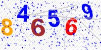

# Sistem Pelatihan CAPTCHA Solver

## Gambaran Umum

Proyek ini mengimplementasikan sistem pelatihan CAPTCHA solver yang canggih menggunakan teknik deep learning. Skrip `train_captcha_solver.py` melatih model CNN multi-output untuk mengenali dan memecahkan gambar CAPTCHA yang mengandung digit numerik.

## Fitur

- **Prapemrosesan Gambar Lanjutan**: Thresholding adaptif yang ditingkatkan dan pemrosesan gambar khusus digit
- **Augmentasi Data**: Pipeline augmentasi data komprehensif dengan berbagai teknik
- **Arsitektur CNN Multi-Output**: Jaringan saraf konvolusional dalam dengan batch normalization dan dropout
- **Optimasi Pelatihan**: Early stopping, model checkpointing, dan reduksi learning rate
- **Pengujian Komprehensif**: Validasi dan pengukuran akurasi bawaan

## Persyaratan

- Python 3.7+
- TensorFlow 2.x
- OpenCV
- NumPy
- scikit-learn
- scikit-image
- imgaug
- SciPy

## Instalasi

```bash
pip install -r requirements.txt
```

## Konfigurasi

Skrip menggunakan parameter yang dapat dikonfigurasi berikut:

```python
# Konfigurasi Gambar
IMAGE_WIDTH = 200          # Lebar target untuk gambar CAPTCHA
IMAGE_HEIGHT = 100         # Tinggi target untuk gambar CAPTCHA
CAPTCHA_LENGTH = 6         # Jumlah karakter dalam setiap CAPTCHA
CHARACTERS = "0123456789" # Set karakter yang mungkin (hanya digit)

# Path File
FOLDER_PATH = 'Samples/'   # Direktori yang berisi gambar pelatihan
MODEL_NAME = 'best_captcha_solver_model.keras'  # Nama file model output
```

## Prapemrosesan Gambar

Sistem mencakup teknik prapemrosesan lanjutan:

1. **Thresholding Adaptif**: Thresholding yang ditingkatkan dengan optimasi parameter untuk deteksi digit
2. **Peningkatan Digit**: Operasi morfologis untuk membersihkan noise dan memperjelas digit
3. **Normalisasi**: Normalisasi intensitas piksel (0.0 hingga 1.0)

## Augmentasi Data

Pipeline pelatihan menggunakan dua pendekatan augmentasi:

### Augmentasi Lanjutan (imgaug)
- Pembalikan horizontal
- Pemotongan acak
- Penyesuaian kontras
- Noise Gaussian
- Variasi kecerahan
- Transformasi affine (skala, translasi, rotasi, shear)

### Augmentasi Kustom
- Rotasi acak (-15° hingga 15°)
- Pergeseran gambar
- Zooming
- Penambahan noise
- Blur Gaussian
- Efek swirl
- Penyesuaian kontras

## Arsitektur Model

Model CNN memiliki fitur:

- **Lapisan Input**: (100, 200, 1) untuk gambar grayscale
- **Blok Konvolusional**: 4 blok dengan filter yang meningkat (32, 64, 128, 256)
- **Batch Normalization**: Setelah setiap lapisan konvolusional
- **Max Pooling**: Setelah setiap blok konvolusional
- **Dropout**: Regularisasi dengan tingkat yang meningkat (0.25 hingga 0.5)
- **Lapisan Dense**: Dua lapisan dense (1024 dan 512 unit)
- **Output Heads**: 6 output softmax (satu untuk setiap posisi karakter CAPTCHA)

## Proses Pelatihan

1. **Pemuatan Data**: Memuat gambar dari direktori `Samples/`
2. **Augmentasi Data**: Menerapkan augmentasi lanjutan dan kustom
3. **Pembagian Data**: 85% pelatihan, 15% validasi
4. **Pelatihan Model**: Menggunakan optimizer Adam dengan learning rate 0.001
5. **Callbacks**:
   - Early stopping (patience=20)
   - Model checkpointing (menyimpan model terbaik)
   - Reduksi learning rate pada plateau

## Contoh Gambar

Sistem ini dirancang untuk bekerja dengan gambar CAPTCHA seperti contoh berikut:



## Penggunaan

### Pelatihan

```bash
python train_captcha_solver.py
```

### Pengujian

Skrip secara otomatis menguji model yang telah dilatih pada sampel validasi dan menampilkan metrik akurasi.

## File Output

- `best_captcha_solver_model.keras`: Model yang telah dilatih dalam format Keras
- `training_history.npy`: Riwayat pelatihan untuk analisis
- Output konsol yang menunjukkan progres pelatihan dan akurasi validasi

## Metrik Kinerja

Sistem melacak dan menampilkan:
- Loss pelatihan dan validasi
- Akurasi pelatihan dan validasi
- Akurasi akhir pada sampel uji
- Statistik augmentasi data

## Catatan

- Gambar harus diberi nama dengan konten CAPTCHA mereka (misalnya, "123456.jpg")
- Sistem dioptimalkan untuk CAPTCHA numerik tetapi dapat diadaptasi untuk alphanumeric
- Pelatihan mungkin memakan waktu beberapa jam tergantung pada hardware dan ukuran dataset
- Model mencapai akurasi tinggi melalui augmentasi data yang ekstensif dan prapemrosesan yang cermat

## Lisensi

Proyek ini open-source dan tersedia untuk modifikasi dan distribusi.
